# 🏦 FinSaathi - AI-Powered Financial Intelligence Platform

<div align="center">

**Empowering enterprises and individuals with real-time financial intelligence through advanced AI models**

[🎬 Watch Demo](https://www.youtube.com/watch?v=fVP2TJPEvbE) | [📖 Documentation](#documentation) | [🚀 Quick Start](#quick-start)

</div>

---

## 📋 Table of Contents

- [Overview](#-overview)
- [Key Features](#-key-features)
- [System Architecture](#-system-architecture)
- [End-to-End Workflow](#-end-to-end-workflow)
- [Project Structure](#-project-structure)
- [Core Components](#-core-components)
  - [Backend Modules](#backend-modules)
  - [Frontend Components](#frontend-components)
- [Internal Processes](#-internal-processes)
- [Technical Indicators](#-technical-indicators)
- [AI/ML Models](#-aiml-models)
- [API Endpoints](#-api-endpoints)
- [Installation & Setup](#-installation--setup)
- [Environment Configuration](#-environment-configuration)
- [Usage Guide](#-usage-guide)
- [Technologies Used](#-technologies-used)
- [Contributing](#-contributing)
- [License](#-license)

---

## 🌟 Overview

**FinSaathi** (Hindi:  "Financial Companion") is a comprehensive AI-powered financial intelligence platform designed to democratize financial analysis for both enterprises and low-income individuals in India. The platform combines cutting-edge AI models (LLaMA-90B, DeepSeek-R1) with sophisticated quantitative analysis techniques to deliver actionable financial insights.

### What Makes FinSaathi Unique?

- **Dual-Purpose Design**: Serves both enterprise-level stock analysis and personal finance assistance for low-income individuals
- **Multi-Channel Delivery**: Web dashboard, PDF reports, and WhatsApp integration
- **Government Scheme Matching**: AI-powered matching of users to eligible government welfare schemes
- **Confidence Scoring**: Transparent reliability metrics for all AI predictions
- **Real-Time Analysis**: Live market data integration with technical indicator computation

---

## ✨ Key Features

### 📊 Enterprise Financial Analysis
- **LLM-Powered Insights**:  Generates comprehensive financial reports using LLaMA-90B and DeepSeek-R1
- **Monte Carlo Simulations**: Price forecasting with 95% confidence intervals
- **Technical Analysis**: 20+ technical indicators including MACD, RSI, Bollinger Bands, ADX
- **Backtesting Engine**: Strategy performance validation with Sharpe Ratio, Win Rate, Max Drawdown

### 💰 Personal Finance Assistance
- **Expense Analysis**: AI-powered budgeting recommendations
- **Savings Plans**: Goal-oriented savings strategies
- **Government Scheme Matching**: Semantic matching to 100+ welfare programs

### 📱 Multi-Channel Delivery
- **Interactive Web Dashboard**: Real-time charts and visualizations
- **PDF Report Generation**: Downloadable comprehensive analysis reports
- **WhatsApp Bot**: Financial insights delivered via messaging
- **Real-Time News Feed**:  Aggregated financial news from multiple RSS sources

### 🔒 Confidence & Transparency
- **Multi-Dimensional Scoring**: Technical, statistical, and market confidence metrics
- **Risk Assessment**: VaR (95%, 99%), Expected Shortfall calculations
- **Interpretation Guides**: Human-readable confidence explanations

---

## 🏗 System Architecture

```
┌─────────────────────────────────────────────────────────────────────────────┐
│                              FinSaathi Platform                              │
├─────────────────────────────────────────────────────────────────────────────┤
│                                                                             │
│  ┌─────────────────────┐     ┌─────────────────────────────────────────┐   │
│  │   Frontend Layer    │     │            Backend Layer                │   │
│  │   (Next.js/React)   │────▶│            (Flask/Python)               │   │
│  └─────────────────────┘     └─────────────────────────────────────────┘   │
│           │                              │                                  │
│           │                              ▼                                  │
│           │                  ┌─────────────────────┐                       │
│           │                  │    AI/ML Engine     │                       │
│           │                  │  ┌───────────────┐  │                       │
│           │                  │  │ LLaMA-90B     │  │                       │
│           │                  │  │ DeepSeek-R1   │  │                       │
│           │                  │  │ MiniLM (NLP)  │  │                       │
│           │                  │  └───────────────┘  │                       │
│           │                  └─────────────────────┘                       │
│           │                              │                                  │
│           ▼                              ▼                                  │
│  ┌─────────────────────┐     ┌─────────────────────────────────────────┐   │
│  │   User Interface    │     │         Data Processing                 │   │
│  │  • Dashboard        │     │  • Technical Indicators (20+)           │   │
│  │  • Charts           │     │  • Monte Carlo Simulation               │   │
│  │  • Forms            │     │  • Backtesting Engine                   │   │
│  │  • News Feed        │     │  • Confidence Scoring                   │   │
│  └─────────────────────┘     └─────────────────────────────────────────┘   │
│                                          │                                  │
│                                          ▼                                  │
│                              ┌─────────────────────────────────────────┐   │
│                              │       External Services                 │   │
│                              │  • yfinance API (Market Data)           │   │
│                              │  • Groq API (LLM Inference)             │   │
│                              │  • Twilio (WhatsApp)                    │   │
│                              │  • Cloudinary (PDF Storage)             │   │
│                              │  • RSS Feeds (News)                     │   │
│                              └─────────────────────────────────────────┘   │
│                                                                             │
└─────────────────────────────────────────────────────────────────────────────┘
```

---

## 🔄 End-to-End Workflow


---

## 📁 Project Structure

```
FinSaathi_Datathon/
├── backend/                          # Flask Backend Server
│   ├── app. py                        # Main Flask application & API routes
│   ├── financial_analyzer.py         # Basic technical analysis module
│   ├── financial_narrative_generator.py  # Advanced analysis with confidence scoring
│   ├── financial_report. py           # Personal finance assistant
│   ├── scheme_matcher.py             # Government scheme matching engine
│   ├── news_fetcher.py               # RSS news aggregator
│   ├── news. py                       # News processing utilities
│   ├── ai_assist.py                  # AI chatbot assistant
│   ├── fin_for_whatsapp.py           # WhatsApp bot integration
│   ├── requirements.txt              # Python dependencies
│   ├── Government_Schemes-English.pdf # Government schemes database
│   └── . env                          # Environment variables
│
├── frontend/                         # Next.js Frontend Application
│   ├── src/
│   │   ├── app/                      # Next.js App Router
│   │   │   ├── (Dashboard)/          # Dashboard routes
│   │   │   ├── (auth)/               # Authentication routes
│   │   │   ├── api/                  # API routes
│   │   │   ├── home/                 # Home page
│   │   │   ├── layout.jsx            # Root layout
│   │   │   ├── page.jsx              # Landing page
│   │   │   └── globals.css           # Global styles
│   │   ├── components/               # React Components
│   │   │   ├── ExpenseTracker.jsx    # Expense tracking component
│   │   │   ├── GovtForm.jsx          # Government scheme form
│   │   │   ├── mode-toggle.jsx       # Theme toggle
│   │   │   ├── theme-provider.jsx    # Theme context
│   │   │   └── ui/                   # ShadCN UI components
│   │   ├── context/                  # React contexts
│   │   ├── hooks/                    # Custom React hooks
│   │   ├── lib/                      # Utility libraries
│   │   ├── assets/                   # Static assets
│   │   └── middleware.js             # Next.js middleware
│   ├── public/                       # Public assets
│   ├── package.json                  # Node.js dependencies
│   ├── tailwind.config.js            # Tailwind CSS configuration
│   └── next. config.mjs               # Next.js configuration
│
└── README.md                         # Project documentation
```

---

## 🔧 Core Components

### Backend Modules

#### 1. `app.py` - Main API Server
The central Flask application that orchestrates all API endpoints and integrates various modules.

**Key Endpoints:**
| Endpoint | Method | Description |
|----------|--------|-------------|
| `/api/health` | GET | Health check |
| `/api/chat` | POST | AI chatbot interaction |
| `/api/analyze` | POST | Basic stock analysis |
| `/api/financial/analyze` | POST | Detailed stock analysis with Monte Carlo |
| `/api/financial/confidence` | POST | Confidence score calculation |
| `/api/financial/backtest` | POST | Strategy backtesting |
| `/api/news` | GET | Financial news feed |
| `/api/generate-pdf` | POST | PDF report generation |

#### 2. `financial_narrative_generator.py` - Advanced Analysis Engine
The core analytical engine that performs comprehensive technical analysis.

**Key Classes:**
- `FinancialNarrativeGenerator`: Main analysis class
- `ConfidenceScorer`: Multi-dimensional confidence scoring

**Capabilities:**
```python
# Technical Indicators Computed
- Moving Averages:  50-MA, 200-MA, 20-EMA
- MACD: Line, Signal, Histogram
- RSI: Relative Strength Index
- Stochastic Oscillator: %K, %D
- Bollinger Bands:  Upper, Lower, Middle, Width
- Volume:  OBV, Accumulation/Distribution Index
- ADX: Average Directional Index
- Support/Resistance Levels
- Volatility Metrics
```

#### 3. `scheme_matcher.py` - Government Scheme Matching
AI-powered semantic matching of user profiles to government welfare schemes.

**Matching Algorithm:**
```
Final Score = (Keyword Score × 0.6) + (Semantic Score × 0.4)
```

**Features:**
- PDF parsing of government scheme documents
- Sentence transformer embeddings (MiniLM)
- Hybrid keyword + semantic matching
- Multi-criteria profiling (gender, age, occupation, category, location)

#### 4. `financial_report.py` - Personal Finance Assistant
Helps low-income individuals with budgeting and financial planning.

**Services:**
- Expense analysis and optimization
- Government assistance program recommendations
- Savings plan generation
- Financial report compilation

#### 5. `fin_for_whatsapp.py` - WhatsApp Integration
Delivers financial insights via WhatsApp using Twilio API.

**Workflow:**
1. User sends "info <TICKER>" via WhatsApp
2. System generates complete technical analysis
3. Creates PDF report
4. Uploads to Cloudinary
5. Sends summary + PDF link to user

### Frontend Components

#### Dashboard Features
- **Stock Analysis Interface**: Symbol search, real-time analysis
- **Interactive Charts**:  Candlestick, momentum, volume charts
- **Expense Tracker**: Personal finance management
- **Government Scheme Finder**: Eligibility matching form
- **News Feed**: Real-time financial news

#### UI Framework
- **ShadCN/UI**: Radix-based component library
- **Tremor**: Dashboard visualization components
- **Recharts**:  Charting library
- **Framer Motion**: Animations

---

## ⚙️ Internal Processes

### 1. Technical Analysis Pipeline


### 2. Monte Carlo Simulation Process

```python
# Simulation Parameters
num_simulations = 1000
forecast_days = 252 (1 trading year)

# Process: 
1. Calculate log returns:  ln(P_t / P_{t-1})
2. Compute mean (μ) and std deviation (σ)
3. For each simulation:
   - Generate random returns ~ N(μ, σ)
   - Apply geometric Brownian motion
   - Project price path
4. Calculate confidence intervals (5th, 95th percentiles)
5. Derive risk metrics (VaR, Expected Shortfall)
```

### 3. Confidence Scoring System

```mermaid
flowchart TB
    subgraph Technical["Technical Confidence (30%)"]
        T1[Trend Agreement]
        T2[RSI Balance]
        T3[MACD Strength]
        T4[ADX Trend Strength]
        T5[Volume Confirmation]
    end

    subgraph Statistical["Statistical Confidence (40%)"]
        S1[Distribution Skewness]
        S2[Volatility Score]
        S3[VaR Confidence]
        S4[Interval Width]
    end

    subgraph Market["Market Confidence (30%)"]
        M1[Sharpe Ratio]
        M2[Win Rate]
        M3[Market Stability]
        M4[Excess Return]
    end

    T1 --> TC[Technical Score]
    T2 --> TC
    T3 --> TC
    T4 --> TC
    T5 --> TC

    S1 --> SC[Statistical Score]
    S2 --> SC
    S3 --> SC
    S4 --> SC

    M1 --> MC[Market Score]
    M2 --> MC
    M3 --> MC
    M4 --> MC

    TC --> OC[Overall Confidence]
    SC --> OC
    MC --> OC

    OC --> INT{Interpretation}
    INT --> |≥0.8| VH[Very High]
    INT --> |≥0.6| H[High]
    INT --> |≥0.4| M[Moderate]
    INT --> |≥0.2| L[Low]
    INT --> |<0.2| VL[Very Low]
```



### 4. Government Scheme Matching Pipeline


---

## 📊 Technical Indicators

| Category | Indicator | Purpose |
|----------|-----------|---------|
| **Trend** | 50-day MA | Medium-term trend |
| | 200-day MA | Long-term trend |
| | 20-day EMA | Short-term responsive trend |
| | ADX | Trend strength measurement |
| **Momentum** | RSI | Overbought/Oversold detection |
| | Stochastic %K, %D | Momentum oscillator |
| | MACD | Trend momentum & crossovers |
| **Volatility** | Bollinger Bands | Price envelope & volatility |
| | BB Width | Volatility squeeze detection |
| | Daily Volatility | Annualized volatility |
| **Volume** | OBV | Volume-price trend confirmation |
| | ADI | Accumulation/Distribution |
| **Risk** | VaR 95% | Value at Risk (95% confidence) |
| | VaR 99% | Value at Risk (99% confidence) |
| | Expected Shortfall | Tail risk measurement |

---

## 🤖 AI/ML Models

| Model | Provider | Use Case |
|-------|----------|----------|
| **LLaMA-90B** | Groq | Financial narrative generation |
| **DeepSeek-R1-Distill-LLaMA-70B** | Groq | Technical analysis insights |
| **LLaMA-3.2-90B-Text-Preview** | Groq | Personal finance recommendations |
| **paraphrase-MiniLM-L3-v2** | Sentence Transformers | Scheme semantic matching |

---

## 🔌 API Endpoints

### Stock Analysis
```http
POST /api/financial/analyze
Content-Type: application/json

{
  "symbol": "TCS. NS"
}

Response: 
{
  "status": "success",
  "data": {
    "symbol": "TCS.NS",
    "narrative": ".. .",
    "technical_analysis": {... },
    "monte_carlo":  {...},
    "historical_data": [...]
  }
}
```

### Confidence Score
```http
POST /api/financial/confidence
Content-Type:  application/json

{
  "symbol": "RELIANCE.NS"
}

Response:
{
  "status": "success",
  "data": {
    "overall_confidence": 0.72,
    "technical_confidence":  {... },
    "statistical_confidence":  {...},
    "market_confidence": {...},
    "interpretation": "High Confidence"
  }
}
```

### AI Chat
```http
POST /api/chat
Content-Type: application/json

{
  "message":  "Explain what is P/E ratio?"
}

Response:
{
  "status":  "success",
  "response": {
    "type": "text",
    "content": ".. .",
    "timestamp": "10:30 AM"
  }
}
```

---

## 🚀 Installation & Setup

### Prerequisites
- **Node.js**: v18.x or higher
- **Python**: 3.9 or higher
- **pip**:  Latest version

### Step 1: Clone Repository
```bash
git clone https://github.com/Adarshh9/FinSaathi_Datathon.git
cd FinSaathi_Datathon
```

### Step 2: Backend Setup
```bash
cd backend

# Create virtual environment
python -m venv venv
source venv/bin/activate  # On Windows: venv\Scripts\activate

# Install dependencies
pip install -r requirements.txt

# Additional dependencies (if not in requirements.txt)
pip install flask flask-cors groq yfinance pandas numpy scipy
pip install ta plotly sentence-transformers scikit-learn pypdf
pip install reportlab fpdf twilio feedparser cloudinary
```

### Step 3: Frontend Setup
```bash
cd frontend

# Install dependencies
npm install

# Or using yarn
yarn install
```

### Step 4: Run the Application

**Terminal 1 - Backend:**
```bash
cd backend
python app.py
# Server runs at http://localhost:5000
```

**Terminal 2 - Frontend:**
```bash
cd frontend
npm run dev
# App runs at http://localhost:3000
```

---

## 🔐 Environment Configuration

### Backend `.env`
```env
# Groq API (Required)
GROQ_API_KEY=your_groq_api_key

# Twilio (For WhatsApp)
TWILIO_ACCOUNT_SID=your_twilio_sid
TWILIO_AUTH_TOKEN=your_twilio_token

# Cloudinary (For PDF storage)
CLOUDINARY_API_KEY=your_cloudinary_secret

# Server
PORT=5000
```

### Frontend `.env.local`
```env
# Clerk Authentication
NEXT_PUBLIC_CLERK_PUBLISHABLE_KEY=your_clerk_key
CLERK_SECRET_KEY=your_clerk_secret

# API
NEXT_PUBLIC_API_URL=http://localhost:5000
```

---

## 📖 Usage Guide

### Web Dashboard
1. Navigate to `http://localhost:3000`
2. Sign in with Clerk authentication
3. Use the stock search to analyze any ticker
4. View technical charts, Monte Carlo projections, and AI insights
5. Download PDF reports for detailed analysis

### WhatsApp Bot
1. Configure Twilio webhook to point to `/webhook`
2. Send `hello` to initiate
3. Send `info AAPL` to get Apple stock analysis
4. Receive summary + PDF download link

### Government Scheme Finder
1. Fill out the profile form (gender, age, occupation, etc.)
2. Submit to find matching government schemes
3. View ranked results with eligibility explanations

---

## 🛠 Technologies Used

### Backend Stack
| Technology | Purpose |
|------------|---------|
| Flask | Web framework |
| Flask-CORS | Cross-origin requests |
| Groq | LLM API provider |
| yfinance | Market data API |
| pandas/numpy | Data processing |
| scipy | Statistical computations |
| TA-Lib (ta) | Technical indicators |
| Plotly | Visualization |
| Sentence Transformers | NLP embeddings |
| ReportLab/FPDF | PDF generation |
| Twilio | WhatsApp integration |
| Cloudinary | Cloud storage |

### Frontend Stack
| Technology | Purpose |
|------------|---------|
| Next.js 14 | React framework |
| React 18 | UI library |
| Tailwind CSS | Styling |
| ShadCN/UI | Component library |
| Radix UI | Primitives |
| Tremor | Charts |
| Recharts | Visualizations |
| Clerk | Authentication |
| Framer Motion | Animations |
| React Query | Data fetching |

---

## 🤝 Contributing

We welcome contributions! Please follow these steps:

1. **Fork** the repository
2. **Create** a feature branch:  `git checkout -b feature/amazing-feature`
3. **Commit** changes: `git commit -m 'Add amazing feature'`
4. **Push** to branch: `git push origin feature/amazing-feature`
5. **Open** a Pull Request

### Development Guidelines
- Follow PEP 8 for Python code
- Use ESLint configuration for JavaScript
- Write meaningful commit messages
- Add tests for new features
- Update documentation as needed

---

## 📄 License

This project is licensed under the **MIT License** - see the [LICENSE](LICENSE) file for details.

---

## 📞 Support

- **Issues**: [GitHub Issues](https://github.com/Adarshh9/FinSaathi_Datathon/issues)
- **Demo**: [YouTube](https://www.youtube.com/watch?v=fVP2TJPEvbE)

---

<div align="center">

**FinSaathi** - *AI-powered financial intelligence for the future* 🚀

Made with ❤️ for the Datathon

</div>
